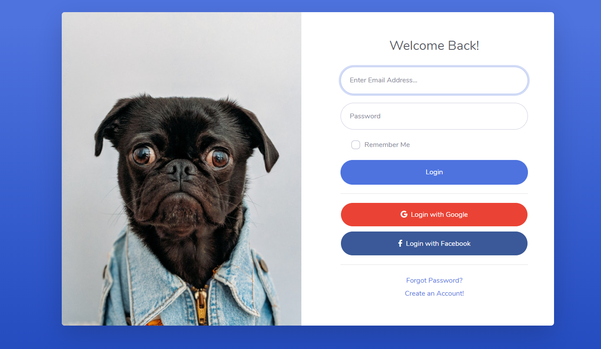
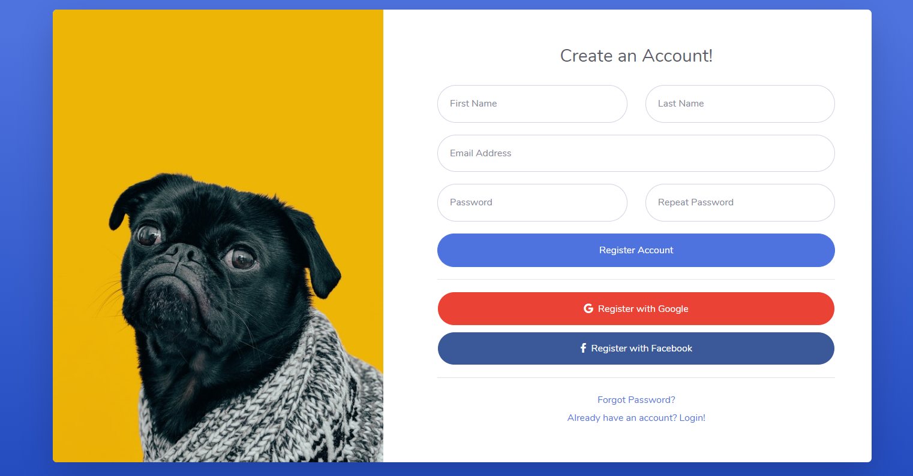
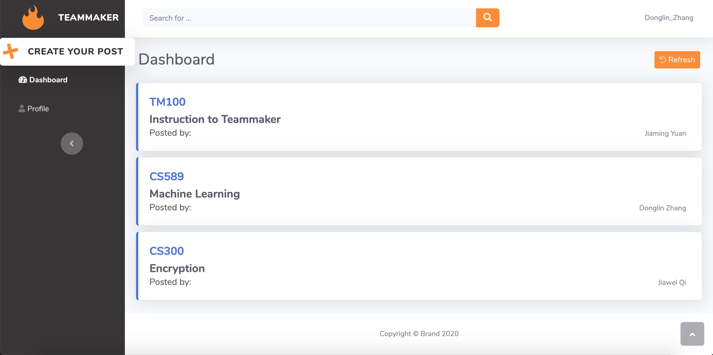
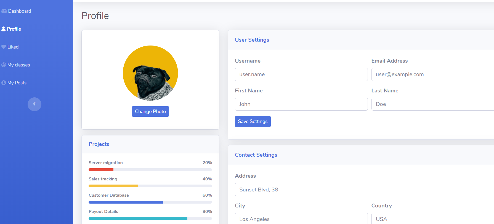
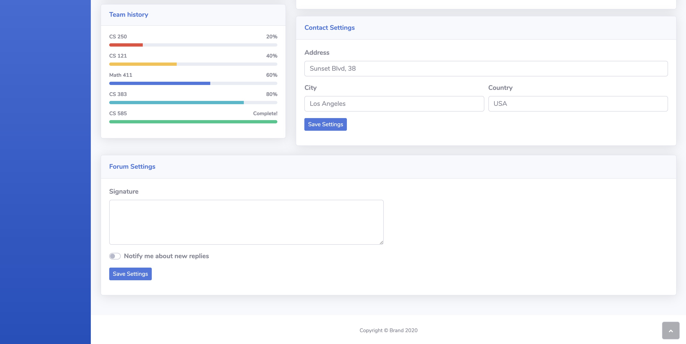

# Final Project for COMPSCI 326
### Team name: Team Theta
### Application name: Teammaker
#### Team Overview
|Names|Github usernames|
|  ----  | ----  |
|Jiawei Qi|chichiauei|
|Jiaming Yuan|jiamingyuan|
|Donglin Zhang|downeyzhang|

#### Innovative Idea
We plan to develop a website that users can find teammates for their classes. For example, they can post messages like they are looking for teammates for CS 383 section B, and post their phone numbers, class's syllabus, professors' names, TAs' names, and probably link to that class in [ratemyprofessor.com](https://www.ratemyprofessors.com/), and they may also mention some requirements for their expected classmates (proficient in Python, know SQL, etc). Our purpose is that since many classes have a term project, they probably need some teammates to cooperate with. We give them chances to invite people that have not yet enroll in these classes or already enrolled in these classes but do know them. Also, some classes might be too challenging, and this app can let users find classmates and solve problems together. Our website does not relate to an existing application.

#### Important Components
1. Users can create account with an email address, and he has to select one university in the process to match the corresponding posts.
2. Users have to login the website so that he can get the access to their accounts. After user login his account, he can: 
    * modify his personal profile, including Name, Birthday, Year in University, Major, and Resume. 
    * create a new post
    * check his post history
    * check the teams he joined
    * leave or reply comments
3. Users can create a post, each post would be assigned a unique ID, and each post needs 4 components: 
    * class informations (Users phone numbers, class's syllabus, professors' names, TAs' names, and link to that class in [ratemyprofessor.com](https://www.ratemyprofessors.com/))
    * Class Grading Policy
    * Detail and requirement for teamates
    * Current teammates
4. In dashboard, users will see a list of posts that posted by other users, and they may also search for posts they looking for by typing post name, teammates name, or post ID via search bar. When users click on one post, a window will appear the detail of this post which contains all details about this post, and there would be a field to leave comments, and a button for requesting into this team.
    * The request to join would notify team leader who created the post. Team leader can approve or reject the request in the notification.
    * Users may leave comments under each post. Also, the comments will notify to all teammates in this post. When the teammate clicks the notification, the browser will jump to this post and he can reply to it.
8. "My Posts" pages will show a list of posts which post by the user. Similar to the dashboard, user can click one of the posts to check its detail in a new interface, including class info, grading policy, requirement and name of current teammates.
9. "My Teams" pages will show a list of posts which the user has joined. When the user click into one of posts, he can check the detail of this post, and contact info of all teammates.

### User Interface

1.  Login: There are 2 ways to login in.
    * login with google/facebook
    * login with their own eamil address and password

    

2. Create an account:

    

<!-- 
3. Dashboard:
The main page of dashboard would be serveral posts from users who comes from the same university. For example, there are four posts which is CS326, CS187, CS589, and CS311 in the screenshot. When the user clicks one of these posts, the detail of this post will be show as below;

    
-->

3. Dashboard:
The main page of dashboard would be serveral posts from users who comes from the same university. By clicking one of these posts, the pages will show the details in it and jump to the corresponding position.

4. Profile
    The users has to login their accounts to get the access to their profiles. In profile page, it shows the information of each user. Each user can modify their information here. 

    

    

5. My Teams
6. My Posts